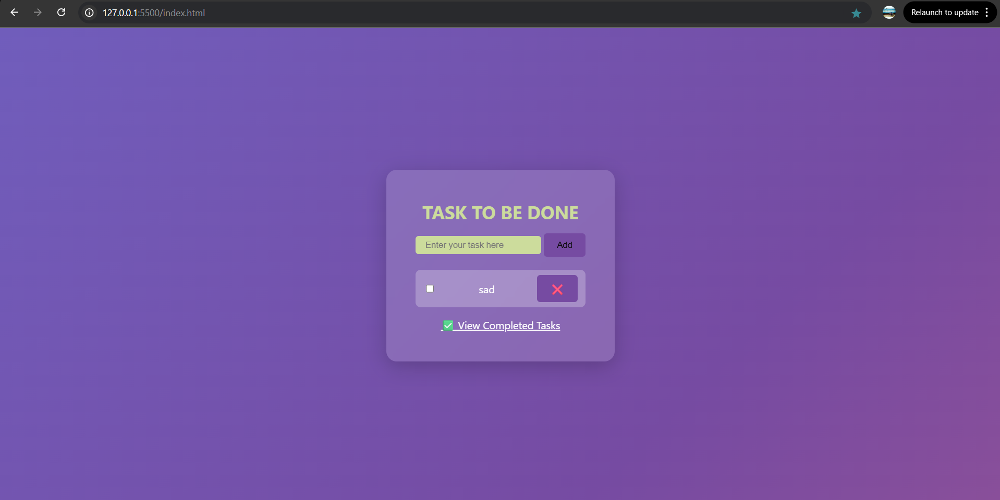

# ✅ To-Do List App

A simple, stylish, and responsive To-Do List web application built using **HTML**, **CSS**, and **JavaScript**.

## 🚀 Features

- Add new tasks
- Mark tasks as completed ✅
- Delete tasks ❌
- Save tasks using **localStorage**
- Auto-syncs on page reload
- Attractive UI with animated **linear gradient background**

## 🛠️ Technologies Used

- HTML5
- CSS3 (Flexbox, Gradient Animations)
- JavaScript (DOM manipulation, localStorage)

## 📸 Screenshots

## 📂 File Structure

todo-list-app/
│
├── pages/
│   ├── index.html
│   └── complete.html
│
├── scripts/
│   ├── script.js
│   └── complete.js
│
├── styles/
│   └── index.css
│
├── README.md

## 🧠 What I Learned

- DOM manipulation in JavaScript
- Storing data locally in the browser
- Designing modern UI using gradients and shadows
- Creating a fully functional frontend project

## 📌 Future Improvements

- Add task deadlines and reminders
- Make completed tasks show on a separate page
- Add task filtering (All / Completed / Pending)

---

## 🧑‍💻 Author

JAGANKUMAR R 

📬 _LinkedIn_: https://www.linkedin.com/in/jagan-kumar-r-3b4394367/
💻 _GitHub_: https://github.com/jagankumarr03

# TO_DO_listapp
